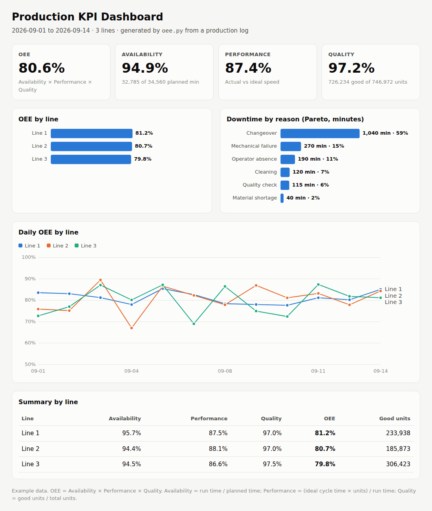

# Production KPI Dashboard (OEE)

Turn a daily production log into an OEE dashboard in one command.
Built from hands-on experience in a manufacturing plant's production area: the numbers
supervisors actually ask for, without a BI license.

**Live demo:** https://juangiles260.github.io/production-kpi-dashboard/



## What you get

- **OEE, Availability, Performance and Quality** for the whole period.
- **OEE by line** to see which line is holding the plant back.
- **Downtime Pareto** by reason, in minutes and % of total, to know what to fix first.
- **Daily OEE trend** per line.
- **Summary table** by line.
- A single self-contained HTML file: open it in any browser, email it, or publish it with GitHub Pages. Works in light and dark mode and on phones.

## How OEE is calculated

| Metric | Formula |
|---|---|
| Availability | run time / planned time, where run time = planned time − downtime |
| Performance | (ideal cycle time × total units) / run time |
| Quality | good units / total units |
| **OEE** | Availability × Performance × Quality |

Totals for a line or period are computed from summed times and units (time-weighted),
not by averaging daily percentages.

## Usage

Requires Python 3.9+. No libraries to install.

```bash
python oee.py data/production_log.csv -o docs/index.html
```

```
OEE 80.6% | Availability 94.9% | Performance 87.4% | Quality 97.2%
Saved to docs/index.html
```

Options: `-o` output file, `--title` dashboard title.

## Input format

One row per line and shift ([example](data/production_log.csv)):

| Column | Example | Meaning |
|---|---|---|
| `date` | 2026-09-01 | Production date |
| `line` | Line 1 | Line or machine |
| `shift` | Morning | Shift |
| `planned_time_min` | 480 | Planned production time (minutes) |
| `downtime_min` | 45 | Stops during planned time (minutes) |
| `downtime_reason` | Changeover | Main reason for the stop (empty if none) |
| `ideal_cycle_time_s` | 2.4 | Ideal seconds per unit |
| `total_count` | 11050 | Units produced |
| `good_count` | 10619 | Units without defects |

The included data is **example data** created with `make_sample_data.py`.

## Tests

```bash
python -m unittest discover -s tests
```

## Need a custom dashboard?

I build production, inventory and sales dashboards in Excel, Google Sheets and Python.
Contact me on [Fiverr](https://www.fiverr.com/juangiles260).

## License

MIT
